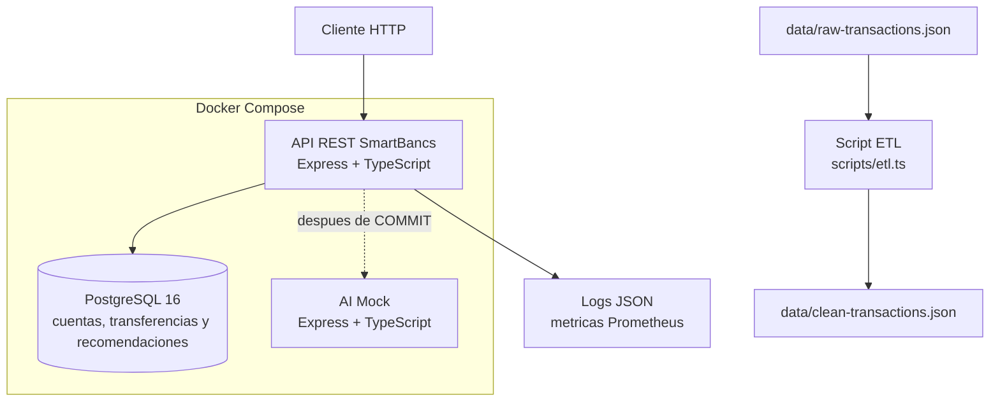
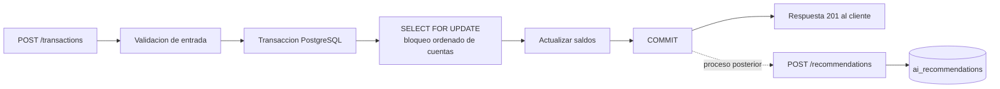
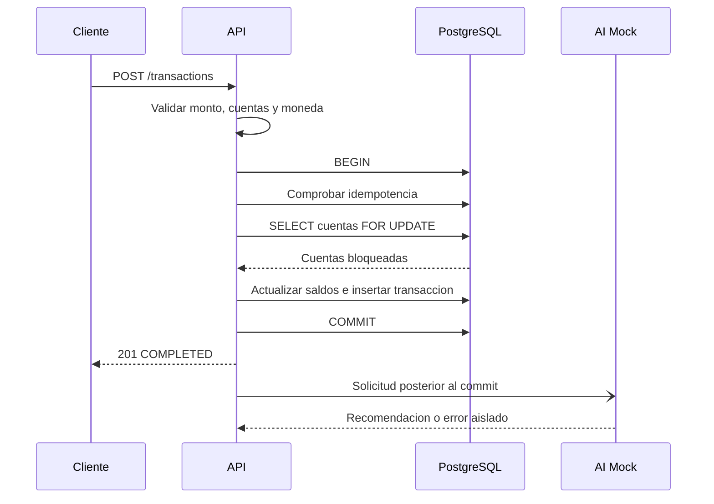
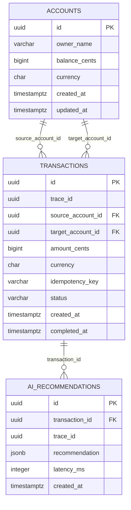
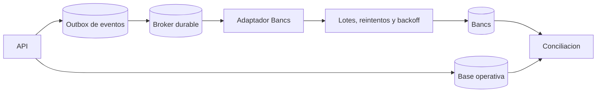
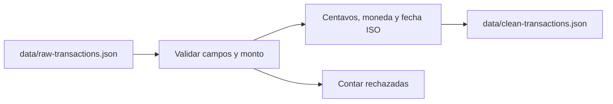

# Documento tecnico SmartBancs

## Resumen

El MVP recibe transferencias por REST, actualiza dos cuentas de forma atomica en PostgreSQL y dispara recomendaciones de IA despues del commit. La recomendacion no bloquea la transferencia.

## Arquitectura

El proyecto utiliza una arquitectura de microservicios ligera, orientada a servicios y desplegada localmente con Docker Compose. El camino transaccional pasa por una API REST y PostgreSQL; el procesamiento de recomendaciones se delega a un servicio separado de IA despues de confirmar la transferencia.



El flujo implementado es:



El archivo `docker-compose.yml` levanta tres contenedores: `smartbancs-db` con PostgreSQL 16, `smartbancs-api` en el puerto 4000 y `smartbancs-ai-mock` en el puerto 4001. El volumen `pgdata` conserva los datos de PostgreSQL y `db/init.sql` crea el esquema inicial y las cuentas de demostracion.

El balanceador, las replicas de API, el broker durable, los workers y el adaptador Bancs representan la evolucion productiva documentada mas adelante; no son componentes implementados en este MVP.

| Componente | Responsabilidad | Implementacion actual |
|---|---|---|
| Cliente | Enviar solicitudes REST y claves de idempotencia | Cliente HTTP, curl o `scripts/smoke-test.ts` |
| API | Validacion, idempotencia, locks y transferencia atomica | TypeScript, Express y `pg`, puerto 4000 |
| PostgreSQL | Saldos, transferencias y recomendaciones | PostgreSQL 16, puerto 5432 |
| AI Mock | Simular inferencia, latencia y fallos | Servicio TypeScript independiente, puerto 4001 |
| ETL | Limpiar datos para analisis o IA | `scripts/etl.ts`, ejecutado fuera de Compose |
| Observabilidad | Logs, metricas y trazabilidad | Pino, `prom-client`, `/metrics` y `traceId` |
| Broker y adaptador Bancs | Desacoplar y agrupar sincronizaciones | Arquitectura productiva propuesta |

### Flujo de una transferencia



La recomendacion no bloquea ni revierte la transferencia confirmada.

## Concurrencia

La API usa `BEGIN/COMMIT`, bloqueo `SELECT ... FOR UPDATE` y orden determinista de IDs antes de bloquear. Esto evita carreras y reduce deadlocks cuando ocurren transferencias inversas. El dinero se maneja en centavos enteros. La clave de idempotencia evita duplicar un reintento.

## Alta concurrencia y escalabilidad

El requisito de 10 000 TPS significa que el sistema debe procesar hasta 10 000 transacciones por segundo bajo una carga sostenida, manteniendo la consistencia de los saldos, sin duplicar transferencias y con limites de latencia y errores definidos. No es suficiente medir la velocidad de una sola instancia; deben medirse tambien el p95/p99 de latencia, la tasa de errores, los bloqueos y la consistencia de los saldos.

El MVP demuestra el patron de consistencia para concurrencia mediante transacciones atomicas, bloqueo de las cuentas involucradas, orden determinista de los locks e idempotencia. Para alcanzar 10 000 TPS en produccion se requieren estas capacidades:

- Varias instancias stateless de la API detras de un balanceador y autoscaling.
- Pool de conexiones controlado, idealmente mediante PgBouncer, sin abrir conexiones ilimitadas contra PostgreSQL.
- PostgreSQL optimizado con indices revisados, replicas de lectura, particionamiento y archivado de transacciones antiguas.
- Un broker durable, como Kafka, RabbitMQ, SQS o Redis Streams, para desacoplar tareas no criticas como recomendaciones de IA.
- Rate limiting, timeouts, backpressure, reintentos limitados con backoff y circuit breakers.
- Metricas de throughput, p95/p99, errores, conexiones, locks, CPU, memoria y uso de disco.

Las transferencias que modifican la misma cuenta pueden competir por el mismo bloqueo de fila. Por eso, particionar el historico no elimina por si solo la contencion sobre una cuenta activa; tambien se debe distribuir la carga entre muchas cuentas y medir el comportamiento con datos representativos.

La capacidad debe comprobarse con una prueba de carga sostenida usando k6, JMeter o Gatling. La prueba debe generar muchas cuentas y claves de idempotencia unicas, ejecutar el objetivo de TPS durante varios minutos y verificar que no existan saldos negativos, transferencias duplicadas ni perdida de eventos. El entorno local del MVP no pretende demostrar 10 000 TPS, sino documentar el patron que permite escalar hacia ese objetivo.

Una cuenta muy activa puede convertirse en un `hot row`: muchas transferencias compiten por el mismo bloqueo. Particionar el historico mejora las consultas, pero no elimina esa contencion; hay que distribuir la carga entre cuentas, mantener transacciones cortas y medir p95/p99, locks, conexiones y timeouts.

## Base de datos y consistencia

El esquema se define en `db/init.sql` y contiene las cuentas, las transferencias y las recomendaciones de IA.



Decisiones importantes:

- El dinero se almacena como `BIGINT` en centavos, nunca como `float`.
- Las claves foraneas evitan cuentas inexistentes y el `CHECK` protege el saldo no negativo.
- El indice unico parcial sobre `(source_account_id, idempotency_key)` evita duplicar reintentos.
- Los indices de `trace_id`, `status` y `created_at` facilitan operacion y auditoria.
- La transaccion SQL actualiza origen, destino e historial en un mismo `COMMIT`; cualquier fallo ejecuta `ROLLBACK`.

El schema completo, sus relaciones, indices y recomendaciones de mejora estan documentados en `REVISION_SCHEMA.md`.

## Bancs

### Estrategia de sincronizacion

Bancs es un core legado robusto, pero no debe recibir una consulta directa por cada request. La arquitectura productiva propuesta es:



La API confirma localmente la transferencia y registra un evento en un patron outbox. Un worker publica eventos con idempotencia, agrupa llamadas y limita la tasa contra Bancs. Los errores se envian a una cola de excepciones y se reprocesan con backoff y circuit breaker.

La conciliacion compara transferencias locales, confirmaciones de Bancs, saldos agregados y eventos pendientes. El adaptador Bancs, el broker y el outbox son arquitectura objetivo; el MVP actual deja preparado el limite de integracion sin llamar al core legado.

## IA

### Integracion actual

`services/ai-mock` expone `POST /recommendations`, simula una demora configurable con `AI_MOCK_DELAY_MS` y puede fallar con `AI_MOCK_FAIL=true`. La API responde despues del `COMMIT` y llama a IA sin `await` en el camino de respuesta. Si IA falla, la transferencia permanece confirmada y el error queda en logs y metricas.

### Evolucion y ciclo de vida del modelo

En produccion conviene publicar un evento en un broker y procesarlo con workers con concurrencia controlada, reintentos, cola de errores y backpressure. El ciclo del modelo seria:

1. ETL y versionado de nuevos datos.
2. Validacion offline de calidad, sesgo y seguridad.
3. Despliegue canary con limites de CPU y memoria.
4. Monitoreo de latencia, errores, calidad y data drift.
5. Promocion o rollback segun criterios definidos.

No se deben enviar al modelo datos sensibles innecesarios ni registrar secretos en logs.

## Observabilidad

### Instrumentacion actual

Los logs JSON registran eventos de recepcion, rechazo, confirmacion, errores y llamadas a IA. Incluyen `event`, `traceId`, `transactionId`, estado, motivo y duracion.

`/metrics` expone volumen de transacciones por estado, duracion de transacciones, llamadas a IA por resultado y metricas por defecto de Node.js. El `traceId` se acepta desde `x-trace-id` si tiene formato UUID o se genera automaticamente.

### Diseno de observabilidad

La observabilidad se organiza en tres senales complementarias:

| Senal | Datos registrados | Utilidad operativa |
|---|---|---|
| Logs | `event`, `traceId`, `transactionId`, estado, motivo, error y duracion | Reconstruir una transferencia concreta y distinguir validacion, fondos insuficientes, conflicto de idempotencia o fallo interno. |
| Metricas | Conteo por estado, duracion de transacciones, llamadas a IA y metricas de Node.js | Detectar aumento de errores, degradacion de latencia, saturacion del proceso y diferencia entre volumen recibido y completado. |
| Trazabilidad | `traceId` en API, transaccion y llamada a IA | Seguir una operacion entre los componentes y correlacionar la respuesta HTTP con sus logs y recomendaciones. |

La informacion debe ser estructurada y no debe incluir contrasenas, tokens ni datos sensibles innecesarios. En produccion, los logs se centralizarian y las metricas se visualizarian en un dashboard con alertas. El MVP expone las señales mediante logs de Docker y el endpoint `/metrics`.

### Indicadores operativos

Para diagnosticar degradacion se deben observar:

- Throughput de solicitudes y transacciones completadas, rechazadas y fallidas.
- Latencia media y percentiles p95/p99 del endpoint `/transactions`.
- Tasa de respuestas `4xx`, `5xx`, timeouts y errores de conexión a PostgreSQL.
- Estado del pool: conexiones activas, disponibles, esperando y agotadas.
- PostgreSQL: `pg_stat_activity`, `pg_locks`, deadlocks, consultas lentas, CPU, memoria, disco y WAL.
- Uso de CPU y memoria de API, AI Mock y PostgreSQL.
- Latencia, errores y cantidad de llamadas al servicio de IA.
- En una arquitectura productiva, profundidad de colas, edad del evento más antiguo y reintentos del broker.

La correlacion recomendada para diagnosticar una solicitud es:

```text
traceId
	-> log transaction_received
	-> consultas y locks observados en PostgreSQL durante la ventana
	-> log transaction_completed o transaction_rejected
	-> log ai_call_started / ai_call_succeeded / ai_call_failed
```

En produccion se recomienda OpenTelemetry para propagar el trace entre API, base de datos, IA y Bancs. Esta capacidad distribuida no esta instalada en el MVP; actualmente se utiliza el `traceId` propio de la API.

### Matriz de diagnostico

| Sintoma | Señales a revisar | Hipotesis inicial | Accion de investigacion |
|---|---|---|---|
| Latencia alta | p95/p99, duracion de transacciones y pool | Contencion de cuentas, consultas lentas o pool agotado | Comparar duracion por `traceId`, revisar `pg_stat_activity` y localizar sesiones esperando. |
| Timeouts de base de datos | Errores de API, conexiones esperando y `pg_stat_activity` | PostgreSQL saturado o conexiones retenidas demasiado tiempo | Revisar limites del pool, transacciones abiertas y consumo de CPU, memoria y disco. |
| Deadlocks | Logs de error, `pg_locks` y eventos de PostgreSQL | Locks adquiridos en orden distinto o transacciones demasiado largas | Identificar las sesiones involucradas y confirmar el orden de bloqueo de las cuentas. |
| Transferencias rechazadas | Contadores por estado y campo `reason` | Datos invalidos, moneda incompatible o fondos insuficientes | Correlacionar el `traceId` con la respuesta y diferenciar error de negocio de error interno. |
| IA degradada | `smartbancs_ai_calls_total`, logs y latencia del mock | Servicio de IA lento o no disponible | Aislar IA; confirmar que las transferencias siguen completandose despues del `COMMIT`. |

## Incidente

### Escenario

Durante un pico de quincena aumentan la latencia, los timeouts de PostgreSQL y los deadlocks. Los usuarios reportan transferencias incompletas.

### Diagnostico y acciones inmediatas

El objetivo inicial es estabilizar el servicio y evitar transferencias parciales, no cambiar el esquema en caliente sin evidencia. El runbook propuesto es:

1. Declarar el incidente, asignar un responsable tecnico y registrar hora de inicio, alcance y cambios recientes.
2. Confirmar el alcance con `/health`, throughput, errores, timeouts y p95/p99.
3. Agrupar logs por `traceId`, `transactionId`, `event`, `reason` y duracion para separar fallos de negocio de fallos de infraestructura.
4. Revisar `pg_stat_activity`, `pg_locks`, conexiones del pool, consultas activas, CPU, memoria, disco y WAL.
5. Identificar la consulta, instancia o cuenta que concentra la contencion; una cuenta muy utilizada puede ser un `hot row`.
6. Activar backpressure o rate limiting y reducir reintentos agresivos para evitar una tormenta de solicitudes.
7. Aislar consumidores no criticos como IA y detener temporalmente workers o llamadas secundarias si consumen conexiones o CPU.
8. Finalizar solo sesiones bloqueadas que hayan sido identificadas y aprobadas por el responsable de base de datos; no matar sesiones al azar.
9. Escalar la API si el cuello esta en concurrencia HTTP y mantener idempotencia en todos los reintentos.
10. Validar la recuperacion con `/health`, errores, latencia, locks y una transferencia controlada antes de cerrar el incidente.

Durante el incidente no se deben desactivar los locks, eliminar restricciones de saldo ni confirmar manualmente una transferencia sin trazabilidad. Si existe duda sobre el estado de una solicitud, se consulta por `idempotencyKey`, `transactionId` y `traceId` antes de reintentar.

### Post mortem y prevencion

El post mortem debe ser sin culpabilizar y debe convertir el incidente en acciones verificables. La estructura propuesta es:

1. **Resumen ejecutivo:** que ocurrio, cuando, duracion, severidad y estado final.
2. **Impacto:** porcentaje de solicitudes afectadas, endpoints, usuarios, transacciones rechazadas o demoradas y si existio impacto financiero.
3. **Deteccion:** alerta o reporte que inicio el incidente, tiempo hasta detectar y tiempo hasta asignar responsable.
4. **Linea de tiempo:** despliegues, aumento de trafico, sintomas, decisiones, mitigaciones y recuperacion, todos con hora y zona horaria.
5. **Evidencias:** metricas, logs por `traceId`, consultas de `pg_stat_activity`, locks, errores y cambios realizados.
6. **Causa raiz y factores contribuyentes:** por ejemplo, pool agotado junto con contencion sobre una cuenta y reintentos excesivos.
7. **Resolucion y comunicacion:** acciones que estabilizaron el servicio, responsables de aprobarlas y mensajes enviados a las partes interesadas.
8. **Que funciono y que no:** alertas, runbooks, pruebas, limites de capacidad y decisiones que deben conservarse o cambiarse.
9. **Acciones preventivas:** tareas concretas con responsable, prioridad, fecha limite y criterio de verificacion.

Acciones preventivas recomendadas:

| Ambito | Accion | Criterio de verificacion |
|---|---|---|
| Infraestructura | Dimensionar el pool, usar PgBouncer y alertar por conexiones esperando | Prueba de carga sin agotamiento del pool y alerta validada. |
| Base de datos | Revisar planes, consultas lentas, locks, deadlocks y particionamiento del historico | `EXPLAIN ANALYZE`, alertas de locks y medicion de p95/p99. |
| Codigo | Mantener orden determinista de locks, acortar transacciones y conservar idempotencia | Pruebas concurrentes sin saldos inconsistentes ni duplicados. |
| Resiliencia | Aplicar backpressure, rate limiting, timeouts, circuit breaker y reintentos con backoff | Simulacion de PostgreSQL o IA degradados sin transferencias parciales. |
| Operacion | Mantener runbook, responsables de guardia y prueba periodica de recuperacion | Simulacro documentado con tiempos de deteccion y recuperacion. |
| Datos | Ejecutar conciliacion, backups y pruebas de restauracion | Restauracion exitosa y diferencias conciliadas entre saldos e historial. |
| Capacidad | Ejecutar pruebas de carga con muchas cuentas y distribuir la carga | Objetivo de TPS, p95/p99 y tasa de errores medidos en un entorno dimensionado. |

El cierre del post mortem requiere comprobar que cada accion tiene evidencia. Una tarea no se considera cerrada solo por estar escrita; debe existir una prueba, alerta, dashboard, cambio de codigo o simulacro que demuestre la mejora.

## ETL y datos para IA

El ETL de `scripts/etl.ts` no participa en la transferencia en tiempo real. Toma `data/raw-transactions.json` y produce `data/clean-transactions.json`.



Limpia nulos e importes invalidos, convierte montos a centavos, normaliza monedas a mayusculas, convierte fechas a ISO y reporta filas aceptadas y rechazadas. Se ejecuta con `npm run etl`.

## Limites del MVP

No demuestra 10 000 TPS en un equipo local. Tampoco incluye autenticacion productiva, adaptador real a Bancs, broker durable, outbox, alta disponibilidad multi-zona, migraciones versionadas ni dashboards externos. Demuestra el patron de consistencia y deja documentado el camino de escalamiento.

Para produccion se requieren replicas stateless de la API, balanceador, PgBouncer, PostgreSQL ajustado, broker, workers, autoscaling, rate limiting, secretos gestionados, backups y pruebas de rendimiento con muchas cuentas.

## Ejecucion y evidencias

Requisitos: Docker Desktop con Compose; Node.js y npm para ETL y smoke test.

```bash
docker compose up --build -d
curl http://localhost:4000/health
curl http://localhost:4001/health
npm install
npm run etl
npm run test:smoke
curl http://localhost:4000/metrics
docker compose logs api ai-mock
docker compose down
```

El smoke test comprueba health, transferencia, idempotencia, conflicto de clave, validacion, fondos insuficientes y concurrencia. Como evidencias de entrega conviene conservar el resultado del smoke test, el conteo del ETL, una transferencia con su `traceId`, logs de IA y la salida de `/metrics`.

## Trazabilidad de entregables

| Entregable | Evidencia |
|---|---|
| Microservicio REST | `services/api/src/server.ts` |
| DDL/DML | `db/init.sql` |
| Infraestructura reproducible | `docker-compose.yml` y Dockerfiles |
| ETL | `scripts/etl.ts` y `data/` |
| Servicio de IA | `services/ai-mock/src/server.ts` |
| Observabilidad | Logs JSON, `/metrics` y `traceId` |
| Prueba de integracion | `scripts/smoke-test.ts` |
| Declaracion de IA | `DECLARACION_IA.md` |
| Instrucciones | `README.md` |
