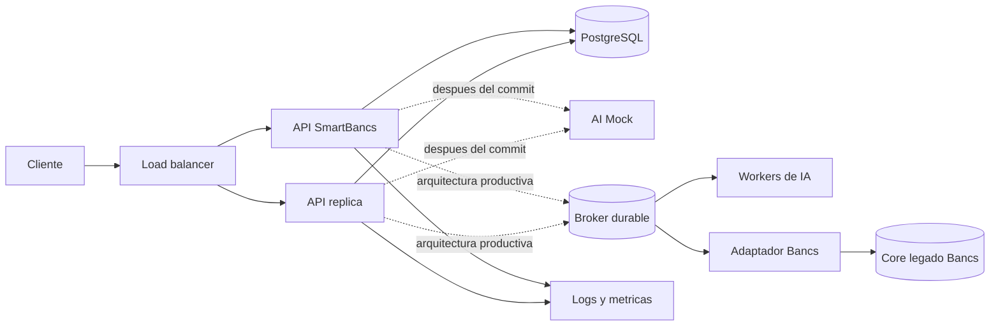
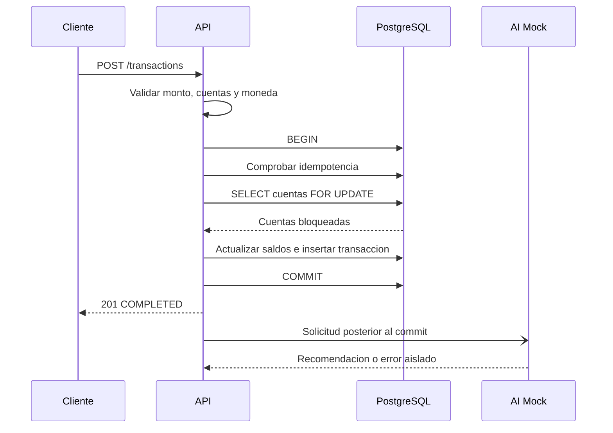
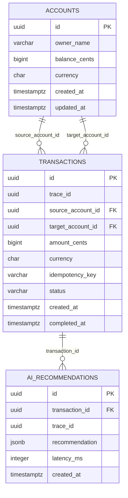
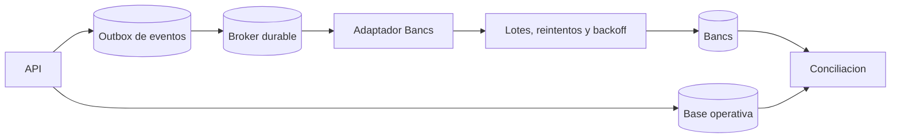
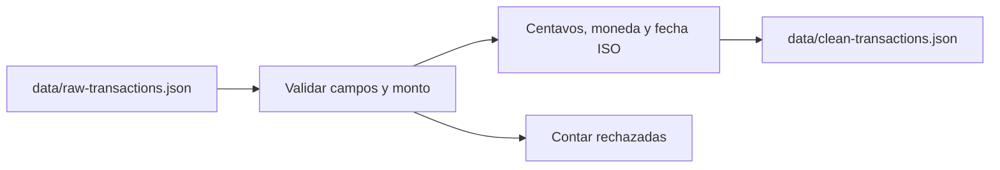

# Documento tecnico SmartBancs

## Resumen

El MVP recibe transferencias por REST, actualiza dos cuentas de forma atomica en PostgreSQL y dispara recomendaciones de IA despues del commit. La recomendacion no bloquea la transferencia.

## Arquitectura

La arquitectura separa el camino transaccional, que debe ser corto y consistente, de los procesos posteriores como IA, conciliacion y sincronizacion con Bancs.



En el MVP, Docker Compose levanta una API, PostgreSQL y el mock de IA. El balanceador, el broker, los workers y el adaptador Bancs representan la evolucion productiva; no se presentan como componentes ya implementados.

| Componente | Responsabilidad | Implementacion actual |
|---|---|---|
| API | Validacion, idempotencia y transferencia atomica | TypeScript, Express y `pg` |
| PostgreSQL | Saldos, transferencias y recomendaciones | PostgreSQL 16 |
| AI Mock | Simular inferencia, latencia y fallos | Servicio TypeScript independiente |
| ETL | Limpiar datos para analisis o IA | `scripts/etl.ts` |
| Broker y adaptador Bancs | Desacoplar y agrupar sincronizaciones | Arquitectura propuesta |

### Flujo de una transferencia



La recomendacion no bloquea ni revierte la transferencia confirmada.

## Concurrencia

La API usa `BEGIN/COMMIT`, bloqueo `SELECT ... FOR UPDATE` y orden determinista de IDs antes de bloquear. Esto evita carreras y reduce deadlocks cuando ocurren transferencias inversas. El dinero se maneja en centavos enteros. La clave de idempotencia evita duplicar un reintento.

## Alta concurrencia y escalabilidad

El requisito de 10 000 TPS significa que el sistema debe procesar hasta 10 000 transacciones por segundo bajo una carga sostenida, manteniendo la consistencia de los saldos, sin duplicar transferencias y con limites de latencia y errores definidos. No es suficiente medir la velocidad de una sola instancia; deben medirse tambien el p95/p99 de latencia, la tasa de errores, los bloqueos y la consistencia de los saldos.

El MVP demuestra el patron de consistencia para concurrencia mediante transacciones atomicas, bloqueo de las cuentas involucradas, orden determinista de los locks e idempotencia. Para alcanzar 10 000 TPS en produccion se requieren estas capacidades:

- Varias instancias stateless de la API detras de un balanceador y autoscaling.
- Pool de conexiones controlado, idealmente mediante PgBouncer, sin abrir conexiones ilimitadas contra PostgreSQL.
- PostgreSQL optimizado con indices revisados, replicas de lectura, particionamiento y archivado de transacciones antiguas.
- Un broker durable, como Kafka, RabbitMQ, SQS o Redis Streams, para desacoplar tareas no criticas como recomendaciones de IA.
- Rate limiting, timeouts, backpressure, reintentos limitados con backoff y circuit breakers.
- Metricas de throughput, p95/p99, errores, conexiones, locks, CPU, memoria y uso de disco.

Las transferencias que modifican la misma cuenta pueden competir por el mismo bloqueo de fila. Por eso, particionar el historico no elimina por si solo la contencion sobre una cuenta activa; tambien se debe distribuir la carga entre muchas cuentas y medir el comportamiento con datos representativos.

La capacidad debe comprobarse con una prueba de carga sostenida usando k6, JMeter o Gatling. La prueba debe generar muchas cuentas y claves de idempotencia unicas, ejecutar el objetivo de TPS durante varios minutos y verificar que no existan saldos negativos, transferencias duplicadas ni perdida de eventos. El entorno local del MVP no pretende demostrar 10 000 TPS, sino documentar el patron que permite escalar hacia ese objetivo.

Una cuenta muy activa puede convertirse en un `hot row`: muchas transferencias compiten por el mismo bloqueo. Particionar el historico mejora las consultas, pero no elimina esa contencion; hay que distribuir la carga entre cuentas, mantener transacciones cortas y medir p95/p99, locks, conexiones y timeouts.

## Base de datos y consistencia

El esquema se define en `db/init.sql` y contiene las cuentas, las transferencias y las recomendaciones de IA.



Decisiones importantes:

- El dinero se almacena como `BIGINT` en centavos, nunca como `float`.
- Las claves foraneas evitan cuentas inexistentes y el `CHECK` protege el saldo no negativo.
- El indice unico parcial sobre `(source_account_id, idempotency_key)` evita duplicar reintentos.
- Los indices de `trace_id`, `status` y `created_at` facilitan operacion y auditoria.
- La transaccion SQL actualiza origen, destino e historial en un mismo `COMMIT`; cualquier fallo ejecuta `ROLLBACK`.

El schema completo, sus relaciones, indices y recomendaciones de mejora estan documentados en `REVISION_SCHEMA.md`.

## Bancs

### Estrategia de sincronizacion

Bancs es un core legado robusto, pero no debe recibir una consulta directa por cada request. La arquitectura productiva propuesta es:



La API confirma localmente la transferencia y registra un evento en un patron outbox. Un worker publica eventos con idempotencia, agrupa llamadas y limita la tasa contra Bancs. Los errores se envian a una cola de excepciones y se reprocesan con backoff y circuit breaker.

La conciliacion compara transferencias locales, confirmaciones de Bancs, saldos agregados y eventos pendientes. El adaptador Bancs, el broker y el outbox son arquitectura objetivo; el MVP actual deja preparado el limite de integracion sin llamar al core legado.

## IA

### Integracion actual

`services/ai-mock` expone `POST /recommendations`, simula una demora configurable con `AI_MOCK_DELAY_MS` y puede fallar con `AI_MOCK_FAIL=true`. La API responde despues del `COMMIT` y llama a IA sin `await` en el camino de respuesta. Si IA falla, la transferencia permanece confirmada y el error queda en logs y metricas.

### Evolucion y ciclo de vida del modelo

En produccion conviene publicar un evento en un broker y procesarlo con workers con concurrencia controlada, reintentos, cola de errores y backpressure. El ciclo del modelo seria:

1. ETL y versionado de nuevos datos.
2. Validacion offline de calidad, sesgo y seguridad.
3. Despliegue canary con limites de CPU y memoria.
4. Monitoreo de latencia, errores, calidad y data drift.
5. Promocion o rollback segun criterios definidos.

No se deben enviar al modelo datos sensibles innecesarios ni registrar secretos en logs.

## Observabilidad

### Instrumentacion actual

Los logs JSON registran eventos de recepcion, rechazo, confirmacion, errores y llamadas a IA. Incluyen `event`, `traceId`, `transactionId`, estado, motivo y duracion.

`/metrics` expone volumen de transacciones por estado, duracion de transacciones, llamadas a IA por resultado y metricas por defecto de Node.js. El `traceId` se acepta desde `x-trace-id` si tiene formato UUID o se genera automaticamente.

### Indicadores operativos

Para diagnosticar degradacion se deben observar throughput, p95/p99, tasa de errores, timeouts, conexiones activas y esperando, locks, deadlocks, CPU, memoria, disco, WAL y profundidad de colas. En produccion se recomienda OpenTelemetry para propagar el trace entre API, base de datos, IA y Bancs.

## Incidente

### Escenario

Durante un pico de quincena aumentan la latencia, los timeouts de PostgreSQL y los deadlocks. Los usuarios reportan transferencias incompletas.

### Diagnostico y acciones inmediatas

1. Confirmar alcance con `/health`, throughput, errores y p95/p99.
2. Agrupar logs por `traceId`, `reason` y duracion.
3. Revisar `pg_stat_activity`, `pg_locks`, conexiones del pool, CPU, memoria y disco.
4. Identificar la consulta o cuenta que concentra la contencion.
5. Aislar consumidores no criticos como IA y activar backpressure.
6. Reducir reintentos agresivos, usar circuit breaker y terminar solo sesiones bloqueadas identificadas.
7. Escalar la API si el cuello esta en concurrencia HTTP y mantener idempotencia para los reintentos.

### Post mortem y prevencion

El post mortem debe incluir impacto, linea de tiempo, deteccion, causa raiz, decisiones, trazas afectadas y acciones con responsable y fecha. Las acciones preventivas incluyen pruebas de carga y caos, alertas de locks y pool agotado, transacciones mas cortas, orden estable de locks, runbooks, backups probados y conciliacion automatizada.

## ETL y datos para IA

El ETL de `scripts/etl.ts` no participa en la transferencia en tiempo real. Toma `data/raw-transactions.json` y produce `data/clean-transactions.json`.



Limpia nulos e importes invalidos, convierte montos a centavos, normaliza monedas a mayusculas, convierte fechas a ISO y reporta filas aceptadas y rechazadas. Se ejecuta con `npm run etl`.

## Limites del MVP

No demuestra 10 000 TPS en un equipo local. Tampoco incluye autenticacion productiva, adaptador real a Bancs, broker durable, outbox, alta disponibilidad multi-zona, migraciones versionadas ni dashboards externos. Demuestra el patron de consistencia y deja documentado el camino de escalamiento.

Para produccion se requieren replicas stateless de la API, balanceador, PgBouncer, PostgreSQL ajustado, broker, workers, autoscaling, rate limiting, secretos gestionados, backups y pruebas de rendimiento con muchas cuentas.

## Ejecucion y evidencias

Requisitos: Docker Desktop con Compose; Node.js y npm para ETL y smoke test.

```bash
docker compose up --build -d
curl http://localhost:4000/health
curl http://localhost:4001/health
npm install
npm run etl
npm run test:smoke
curl http://localhost:4000/metrics
docker compose logs api ai-mock
docker compose down
```

El smoke test comprueba health, transferencia, idempotencia, conflicto de clave, validacion, fondos insuficientes y concurrencia. Como evidencias de entrega conviene conservar el resultado del smoke test, el conteo del ETL, una transferencia con su `traceId`, logs de IA y la salida de `/metrics`.

## Trazabilidad de entregables

| Entregable | Evidencia |
|---|---|
| Microservicio REST | `services/api/src/server.ts` |
| DDL/DML | `db/init.sql` |
| Infraestructura reproducible | `docker-compose.yml` y Dockerfiles |
| ETL | `scripts/etl.ts` y `data/` |
| Servicio de IA | `services/ai-mock/src/server.ts` |
| Observabilidad | Logs JSON, `/metrics` y `traceId` |
| Prueba de integracion | `scripts/smoke-test.ts` |
| Declaracion de IA | `DECLARACION_IA.md` |
| Instrucciones | `README.md` |
