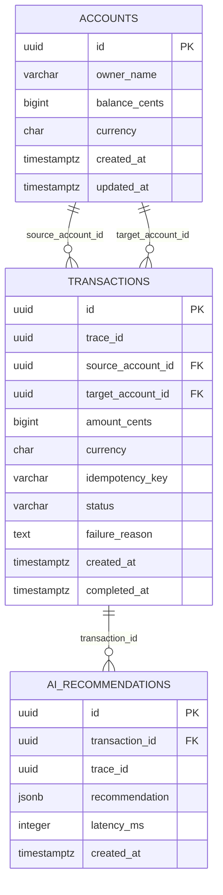

# Revision del schema de SmartBancs

## 1. Objetivo

Este documento sirve para revisar el modelo de datos del MVP, entender sus relaciones y comprobar que soporta el flujo principal de transferencias, idempotencia, recomendaciones de IA y observabilidad.

El schema se define actualmente en `db/init.sql` y utiliza PostgreSQL.

## 2. Diagrama relacional



## 3. Tabla `accounts`

Representa las cuentas bancarias que participan en las transferencias.

| Columna | Tipo | Regla | Propósito |
|---|---|---|---|
| `id` | `UUID` | `PRIMARY KEY` | Identificador de la cuenta |
| `owner_name` | `VARCHAR(120)` | `NOT NULL` | Nombre del titular de demostración |
| `balance_cents` | `BIGINT` | `NOT NULL`, `>= 0` | Saldo almacenado en centavos |
| `currency` | `CHAR(3)` | `NOT NULL`, default `USD` | Moneda de la cuenta |
| `created_at` | `TIMESTAMPTZ` | `NOT NULL` | Fecha de creación |
| `updated_at` | `TIMESTAMPTZ` | `NOT NULL` | Fecha de última modificación |

### Decisión importante

El dinero se guarda en `balance_cents` como entero. Esto evita errores de precisión propios de los números decimales de punto flotante.

Ejemplo:

```text
500000 centavos = 5000.00 USD
```

## 4. Tabla `transactions`

Representa cada intento de transferencia entre dos cuentas.

| Columna | Tipo | Regla | Propósito |
|---|---|---|---|
| `id` | `UUID` | `PRIMARY KEY` | Identificador de la transferencia |
| `trace_id` | `UUID` | `NOT NULL` | Rastreo en logs y servicios |
| `source_account_id` | `UUID` | FK a `accounts` | Cuenta origen |
| `target_account_id` | `UUID` | FK a `accounts` | Cuenta destino |
| `amount_cents` | `BIGINT` | `NOT NULL`, `> 0` | Monto transferido |
| `currency` | `CHAR(3)` | `NOT NULL`, default `USD` | Moneda de la transferencia |
| `idempotency_key` | `VARCHAR(120)` | Opcional | Evita duplicar reintentos |
| `status` | `VARCHAR(20)` | Default `PENDING` | Estado de la transferencia |
| `failure_reason` | `TEXT` | Opcional | Motivo de fallo |
| `created_at` | `TIMESTAMPTZ` | Default `now()` | Fecha de creación |
| `completed_at` | `TIMESTAMPTZ` | Opcional | Fecha de confirmación |

### Relaciones con `accounts`

Existen dos relaciones diferentes con la misma tabla:

```text
transactions.source_account_id -> accounts.id
transactions.target_account_id -> accounts.id
```

Una cuenta puede ser origen o destino de muchas transferencias.

### Idempotencia

El índice:

```sql
CREATE UNIQUE INDEX idx_transactions_idempotency
ON transactions(source_account_id, idempotency_key)
WHERE idempotency_key IS NOT NULL;
```

impide registrar dos veces la misma clave para una misma cuenta origen. La API además verifica que el monto, destino y moneda coincidan con el primer intento.

## 5. Tabla `ai_recommendations`

Almacena la respuesta generada por el servicio de IA después de completar la transferencia.

| Columna | Tipo | Regla | Propósito |
|---|---|---|---|
| `id` | `UUID` | `PRIMARY KEY` | Identificador de recomendación |
| `transaction_id` | `UUID` | FK a `transactions` | Transferencia relacionada |
| `trace_id` | `UUID` | `NOT NULL` | Correlación entre servicios |
| `recommendation` | `JSONB` | `NOT NULL` | Respuesta flexible del modelo |
| `latency_ms` | `INTEGER` | Opcional | Duración de la llamada a IA |
| `created_at` | `TIMESTAMPTZ` | Default `now()` | Fecha de persistencia |

La relación es de una transferencia a cero o varias recomendaciones. En el MVP normalmente se guarda una recomendación, pero el modelo permite guardar nuevas versiones o reintentos.

## 6. Integridad y concurrencia

La API protege la transferencia con una transacción:

```sql
BEGIN;
SELECT ... FOR UPDATE;
UPDATE accounts ...;
UPDATE accounts ...;
INSERT INTO transactions ...;
COMMIT;
```

Las dos cuentas se bloquean en orden determinista antes de modificar saldos. Esto evita carreras y reduce el riesgo de deadlock cuando existen transferencias simultáneas en sentidos opuestos.

Las claves foráneas evitan transferencias hacia cuentas inexistentes. El `CHECK` de `balance_cents` impide saldos negativos a nivel de base de datos.

## 7. Índices actuales

| Índice | Tabla | Uso |
|---|---|---|
| `accounts_pkey` | `accounts` | Búsqueda por cuenta |
| `transactions_pkey` | `transactions` | Búsqueda por transferencia |
| `idx_transactions_trace_id` | `transactions` | Consultar una operación por trazabilidad |
| `idx_transactions_status` | `transactions` | Filtrar pendientes, completadas o fallidas |
| `idx_transactions_created_at` | `transactions` | Consultas por fecha |
| `idx_transactions_idempotency` | `transactions` | Reintentos idempotentes |
| `ai_recommendations_pkey` | `ai_recommendations` | Búsqueda por recomendación |
| `idx_ai_recommendations_tx` | `ai_recommendations` | Buscar recomendaciones de una transferencia |

## 8. Revisión técnica y mejoras recomendadas

### 8.1 Agregar restricciones de estado

Actualmente `status` es texto libre. Conviene evitar valores inválidos:

```sql
ALTER TABLE transactions
ADD CONSTRAINT transactions_status_check
CHECK (status IN ('PENDING', 'COMPLETED', 'FAILED'));
```

### 8.2 Evitar transferencias a la misma cuenta en la base

La API ya rechaza esta operación, pero la base también debe protegerse:

```sql
ALTER TABLE transactions
ADD CONSTRAINT transactions_different_accounts_check
CHECK (source_account_id <> target_account_id);
```

### 8.3 Validar monedas

Para un MVP, el formato de tres caracteres es suficiente, pero conviene normalizar a mayúsculas. En producción se puede crear una tabla `currencies` o una restricción controlada.

También conviene validar que la moneda de la transferencia sea igual a la moneda de ambas cuentas, como ya hace la API.

### 8.4 Actualizar `updated_at` automáticamente

El campo `updated_at` se actualiza explícitamente desde la API. Para evitar que otro proceso lo olvide, puede agregarse un trigger:

```sql
CREATE OR REPLACE FUNCTION set_updated_at()
RETURNS TRIGGER AS $$
BEGIN
    NEW.updated_at = now();
    RETURN NEW;
END;
$$ LANGUAGE plpgsql;

CREATE TRIGGER accounts_updated_at
BEFORE UPDATE ON accounts
FOR EACH ROW
EXECUTE FUNCTION set_updated_at();
```

### 8.5 Controlar duplicados de recomendaciones

Si el negocio exige una sola recomendación por transferencia, agregar:

```sql
CREATE UNIQUE INDEX idx_one_recommendation_per_transaction
ON ai_recommendations(transaction_id);
```

Si se necesitan versiones o reintentos, conservar el modelo actual y agregar una columna como `model_version` o `attempt`.

### 8.6 Mejorar el rastreo

`trace_id` tiene índice en `transactions`, pero no en `ai_recommendations`. Si se consultan recomendaciones por traza, conviene agregar:

```sql
CREATE INDEX idx_ai_recommendations_trace_id
ON ai_recommendations(trace_id);
```

### 8.7 Estrategia de retención

En producción, `transactions` y `ai_recommendations` crecerán continuamente. Se debe definir:

- Retención de logs y recomendaciones.
- Archivado de transacciones históricas.
- Particionamiento de `transactions` por `created_at`.
- Índices revisados con `EXPLAIN ANALYZE`.

## 9. Riesgos a considerar

- `BIGINT` puede ser recibido por el driver de PostgreSQL como `string`; la API debe convertirlo con cuidado, como hace al comparar el saldo.
- `CHAR(3)` puede devolver espacios de relleno; la API usa `trim()` al comparar monedas.
- `CREATE TABLE IF NOT EXISTS` no modifica una tabla ya existente. Cambios posteriores requieren migraciones.
- El volumen del JSONB de recomendaciones debe limitarse para evitar crecimiento descontrolado.
- El índice de idempotencia está basado en `source_account_id` y clave; el contrato de la API debe mantener la clave estable por reintento.

## 10. Comandos para revisar el schema

Con los contenedores activos:

```powershell
# Tablas

docker compose exec postgres psql -U smartbancs -d smartbancs -c "\\dt"

# Estructura de tablas

docker compose exec postgres psql -U smartbancs -d smartbancs -c "\\d+ accounts"
docker compose exec postgres psql -U smartbancs -d smartbancs -c "\\d+ transactions"
docker compose exec postgres psql -U smartbancs -d smartbancs -c "\\d+ ai_recommendations"

# Relaciones y restricciones

docker compose exec postgres psql -U smartbancs -d smartbancs -c "SELECT conrelid::regclass AS table_name, conname, pg_get_constraintdef(oid) FROM pg_constraint WHERE connamespace = 'public'::regnamespace ORDER BY 1, 2;"

# Índices

docker compose exec postgres psql -U smartbancs -d smartbancs -c "SELECT tablename, indexname, indexdef FROM pg_indexes WHERE schemaname = 'public' ORDER BY tablename, indexname;"

# Volumen de datos

docker compose exec postgres psql -U smartbancs -d smartbancs -c "SELECT 'accounts' AS table_name, count(*) FROM accounts UNION ALL SELECT 'transactions', count(*) FROM transactions UNION ALL SELECT 'ai_recommendations', count(*) FROM ai_recommendations;"
```

## 11. Verificacion funcional del schema

Una revision minima debe confirmar:

- Una transferencia valida descuenta origen y acredita destino.
- Un monto invalido no modifica cuentas.
- Un saldo insuficiente no crea una transferencia completada.
- Una cuenta inexistente es rechazada por la API.
- Repetir una `idempotency_key` no duplica saldos.
- Las transferencias concurrentes no producen saldo negativo.
- Una recomendacion queda vinculada a una transferencia existente.
- Un rollback no deja registros parciales.

## 12. Conclusión

El schema actual es suficiente para el MVP y cubre las entidades principales del reto. Sus fortalezas son el uso de centavos enteros, claves foráneas, `CHECK` de saldo, índices de trazabilidad e idempotencia.

Antes de una implementación productiva se deben agregar migraciones formales, restricciones de estado, protección contra transferencias a la misma cuenta, estrategia de retención y pruebas de rendimiento sobre índices y bloqueos.
